## README

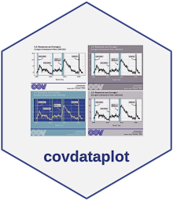

# Overview

**`covdataplot`** is an R package for creating and exporting ggplot graphics in the professional brand style for the City of Covington, Kentucky. 

# Installation

covdataplot can be installed directly from Github using **`devtools`**  If the **`devtools`** package is installed, run the line of code below to install **`covdataplot.`** 

``` r

devtools::install_github('covanalytics/covdataplot')

```

# Colors and Palettes

Colors that match branding guidelines are stored in two variables:
**`covington_colors`** and **`covdata_palette_colors`**.

**`covington_colors`** is a character string that contains the Pantones
and Neutral branding colors, and the original Covington Blue
(covington.og.blue). It is best to access this variable to apply color
to the data components of the graphics plot (i.e., points, bars, lines,
etc.) when only one color is needed.

``` r
#` colors for styling data in graphs (points, bars, etc.)
covington_colors <<- c("covington.blue" = "#0047ba",
                    "covington.navy" = "#211261",
                    "covington.dark.blue" = "#000b8c",
                    "covington.light.blue" = "#00c1de",
                    "covington.green" = "#38d430",
                    "covington.red" = "#ea0029",
                    "covington.yellow" = "#ffc600",
                    "covington.black" = "#000000",
                    "covington.gray" = "#878787",
                    "covington.light.gray" = "#cccccc",
                    "covington.plain" = "#ffffff",
                    "covington.og.blue" = "#46b5d2")


#kable(covington_colors, col.names = 'covington_colors')
```

**`covdata_palette_colors`** is a list of character strings that
contains 14 color palettes, including the Brand, Pantones, and Neutrals
palettes. The additional palettes (‘Blues’ through ‘Set3’) are needed
when data components of the graphics plot must be styled to show
differences in along continuous, diverging, or discrete scales. These
color palettes were borrowed from [R Color Brewer’s
palettes](https://r-graph-gallery.com/38-rcolorbrewers-palettes.html).
All of the color palettes are printed below.

``` r
covdata_palette_colors <<- list(
  Brand = c("#1100ff", "#030055", "#09008a", "#00c4f7", "#00e900", "#ff0000", "#ffc500"),
  Pantones = c("#0047ba", "#211261", "#000b8c", "#00c1de", "#38d430", "#ea0029", "#ffc600"),
  Neutrals = c("#000000", "#878787", "#cccccc", "#ffffff"),
  Blues = c("#F7FBFF", "#DEEBF7", "#C6DBEF", "#9ECAE1", "#6BAED6", 
            "#4292C6", "#2171B5", "#08519C", "#08306B"),
  Greens = c("#F7FCF5", "#E5F5E0", "#C7E9C0", "#A1D99B", "#74C476", "#41AB5D", "#238B45", "#006D2C", "#00441B"),
  Reds = c("#FFF5F0", "#FEE0D2", "#FCBBA1", "#FC9272", "#FB6A4A", "#EF3B2C", "#CB181D", "#A50F15", "#67000D"),
  Greys = c("#FFFFFF", "#F0F0F0", "#D9D9D9", "#BDBDBD", "#969696", "#737373", "#525252", "#252525", "#000000"),
  YlOrRd = c("#FFFFCC", "#FFEDA0", "#FED976", "#FEB24C", "#FD8D3C", "#FC4E2A", "#E31A1C", "#BD0026", "#800026"),
  YlGnBu = c("#FFFFD9", "#EDF8B1", "#C7E9B4", "#7FCDBB", "#41B6C4", "#1D91C0", "#225EA8", "#253494", "#081D58"),
  RdYlBu = c("#A50026", "#D73027", "#F46D43", "#FDAE61", "#FEE090", 
             "#FFFFBF", "#E0F3F8", "#ABD9E9", "#74ADD1", "#4575B4", "#313695"),
  RdBu = c("#67001F", "#B2182B", "#D6604D", "#F4A582", "#FDDBC7", "#F7F7F7",
           "#D1E5F0", "#92C5DE", "#4393C3", "#2166AC", "#053061"),
  Spectral = c("#9E0142", "#D53E4F", "#F46D43", "#FDAE61", "#FEE08B", 
               "#FFFFBF", "#E6F598", "#ABDDA4", "#66C2A5", "#3288BD", "#5E4FA2"),
  Paired = c("#A6CEE3", "#1F78B4", "#B2DF8A", "#33A02C", "#FB9A99",
             "#E31A1C", "#FDBF6F", "#FF7F00", "#CAB2D6", "#6A3D9A",
             "#FFFF99", "#B15928"),
  Set3 = c("#8DD3C7", "#FFFFB3", "#BEBADA", "#FB8072", "#80B1D3",
           "#FDB462", "#B3DE69", "#FCCDE5", "#D9D9D9", "#BC80BD",
           "#CCEBC5", "#FFED6F"))
```

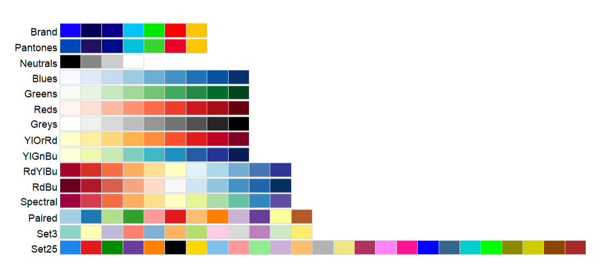

# City Logos

The four City of Covington logos displayed below are used in **`covdataplot`**. The logo names are stored in an
character string named **`covington_logos`**.  *Unfortunately, at this time, we cannot make the image files for these logos publicly available.*

``` r
covington_logos <<- c("cov.seal.blue"="cov.seal.BLUE.png",
                     "cov.seal.white"="cov.seal.WHITE.png",
                     "cov.logo.blue"="cov.logo.BLUEtm.png",
                     "cov.logo.white"="cov.logo.WHITEtm.png")


#kable(covington_logos, col.names = 'covington_logos')
```


# Usage

## Data Components

Several functions were created to customize the data components of the
graphics plots to match the branding guidelines. The following functions
make it easier to change the outline and fill colors of visual marks
that are used to represent data.

**Note: Data used in examples below is sampled, and does accurately reflect Covington incentives.**

### covdata_color()

**`covdata_color()`** was created to access the HEX color code options
available in **`covington_colors`** by name. In the example below,
**`covdata_colors("Covington.Blue")`** is used to return the HEX code
*#0047ba* and change the fill and outline color for the bars
representing fiscal year. Calling the function without a color name
returns the color names and associated HEX codes of all options
available in the variable **`covington_colors`**.

``` r
#` function to assign color from 'covdata_colors' vector to geoms in graph
covdata_color <- function(...) {
  cols <- c(...)
  if (is.null(cols))
    return (covington_colors)
  covington_colors[cols]
}


cov_graph_fill <- cov_graph +
  geom_bar(stat = "identity", fill = covdata_color("covington.blue"))+
  labs(title = "Fill")
     

cov_graph_color <- cov_graph +
  geom_bar(stat = "identity",
           color = covdata_color("covington.blue"),
           fill = NA)+
  labs(title = "Outline-Color")

ggarrange(cov_graph_fill, cov_graph_color, nrow = 1)

```

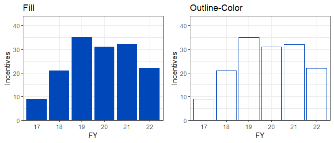

### covdata_palettes()

**`covdata_palettes()`** was created to generate a color palette from
the list of colors in **covdata_palette_colors**. The function has five
arguments–**name**, **n**, **all_palettes**, **type**, **reverse**.

-   **name** is the name of the color palette we want to use
-   **n** is the number of colors from the color paletee we want to use
-   **all_palettes** is the list of color palettes we want to extract
    our choice from. The default choice is set to use
    **covdata_palette_colors**
-   **type** is used to select between a discrete or continuous color
    palette
-   **reverse** is used to change the default order of colors contained
    in the selected palette

Calling **`covdata_palettes("Brand")`** returns the HEX color codes that
make up the *Brand* color palette

``` r
# function to create a color palette for display from  covdata_palette_colors
covdata_palettes <<- function(name, 
                            n, 
                            all_palettes = covdata_palette_colors, 
                            type = c("discrete", "continuous"),
                            reverse = FALSE) {
  palette <- all_palettes[[name]]
  if (missing(n)) {                              # return length of palette if number of colors not provided
    n = length(palette)                          # discrete type can not return additional colors in palette
  }
  
  if(reverse) palette <- rev(palette)            # reverse order of palette colors if reverse is TRUE
  
  type <- match.arg(type)
  out <- switch(type,
               continuous = grDevices::colorRampPalette(palette)(n), # set n to interpolate palette for more colors
               discrete = palette[1:n] 
  )
  
  structure(out, name = name, class = "palette")
}


covdata_palettes("Brand")
```

    ## [1] "#1100ff" "#030055" "#09008a" "#00c4f7" "#00e900" "#ff0000" "#ffc500"
    ## attr(,"name")
    ## [1] "Brand"
    ## attr(,"class")
    ## [1] "palette"

### covdata_color_d()

**`covdata_color_d()`** was created to apply a color aesthetic to a discrete variable using a discrete color palette generated from **`covdata_palettes()`**.  The function has two arguments–**name** and **reverse**.

-   **name** is the name of the color palette we want to use
-   **reverse** is used to change the default order of colors contained
    in the selected palette

In the example below, the *Pantones* color palette is reversed to
represent fiscal years as points.

``` r
# function to color with discrete color palette
covdata_color_d <<- function(name, reverse = FALSE){
  if(reverse) {
  ggplot2::scale_colour_manual(values = covdata_palettes(name,
                                                         type = "discrete",
                                                         reverse = TRUE))
  }else
  ggplot2::scale_colour_manual(values = covdata_palettes(name,
                                                         type = "discrete"))
}


cov_graph +
  geom_point(stat = "identity", aes(color = FY), size = 4)+
  
  covdata_color_d("Pantones", reverse = TRUE)
```

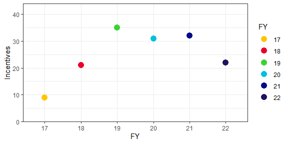

### covdata_fill_d()

**`covdata_fill_d()`** was created to apply a fill aesthetic to a discrete variable using a discrete color palette
generated from **`covdata_palettes()`**.  The function has two arguments–**name** and **reverse**.

-   **name** is the name of the color palette we want to use
-   **reverse** is used to change the default order of colors contained
    in the selected palette

In the example below, the *Pantones* color palette is used to represent
fiscal years as bars.

``` r
# function to fill color with discrete color palette
covdata_fill_d <<- function(name, reverse = FALSE){
  if(reverse) {
    ggplot2::scale_fill_manual(values = covdata_palettes(name,
                                                           type = "discrete",
                                                           reverse = TRUE))
  }else
    ggplot2::scale_fill_manual(values = covdata_palettes(name,
                                                           type = "discrete"))
}


cov_graph +
  geom_bar(stat = "identity", aes(fill = FY))+
  
  covdata_fill_d("Pantones")
```

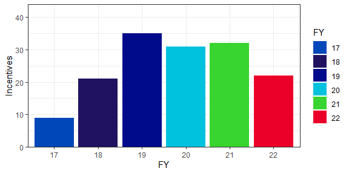

### covdata_color_c()

**`covdata_color_c()`** was created to apply a color aesthetic to a continuous variable using a continuous color
palette generated from **`covdata_palettes()`**.  The function has two arguments–**name** and **reverse**.

-   **name** is the name of the color palette we want to use
-   **reverse** is used to change the default order of colors contained
    in the selected palette

In the example below, the *YlOrRd* color palette is used to show
differences in incentives issued over fiscal year (points).

``` r
# function to color with continuous color palette
covdata_color_c <<- function(name, reverse = FALSE){
  if(reverse) {
    ggplot2::scale_colour_gradientn(colours = covdata_palettes(name,
                                                           type = "continuous",
                                                           reverse = TRUE))
  }else
    ggplot2::scale_colour_gradientn(colours = covdata_palettes(name,
                                                           type = "continuous"))
}


cov_graph +
  geom_point(stat = "identity", aes(color = Incentives), size = 4)+
  
  covdata_color_c("YlOrRd")
  
```

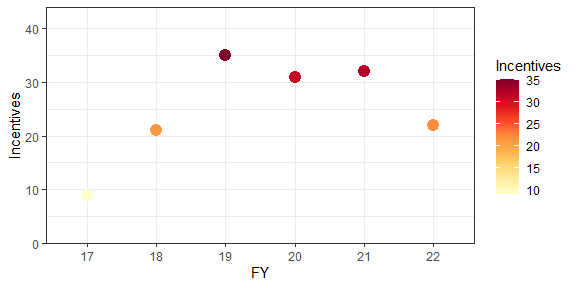

### covdata_fill_c()

**`covdata_fill_c()`** was created to apply a fill aesthetic to a continuous variable using a continuous color
palette generated from **`covdata_palettes()`**.  The function can be used to fill points with color when
*size* and *shape* arguments are supplied to `geom_point()`. The function has two arguments–**name** and **reverse**.

-   **name** is the name of the color palette we want to use
-   **reverse** is used to change the default order of colors contained
    in the selected palette

In the example below, the *YlOrRd* color palette is used to show
differences in incentives issued over fiscal year.

``` r
# function to fill color with continuous color palette

covdata_fill_c <<- function(name, reverse = FALSE){
  if(reverse) {
    ggplot2::scale_fill_gradientn(colours = covdata_palettes(name,
                                                               type = "continuous",
                                                               reverse = TRUE))
  }else
    ggplot2::scale_fill_gradientn(colours = covdata_palettes(name,
                                                               type = "continuous"))
}


pnt_fill <- cov_graph +
  geom_point(stat = "identity", color='black', shape=21, size=4, aes(fill = Incentives))+
  
  covdata_fill_c("YlOrRd") +
  labs(title = "Point Fill")+
  

bar_fill <- cov_graph +
  geom_bar(stat = "identity", aes(fill = Incentives), size = 4)+
  
  covdata_fill_c("YlOrRd") +
  labs(title = "Bar Fill")+
  

ggarrange(pnt_fill, bar_fill, nrow = 1)
```

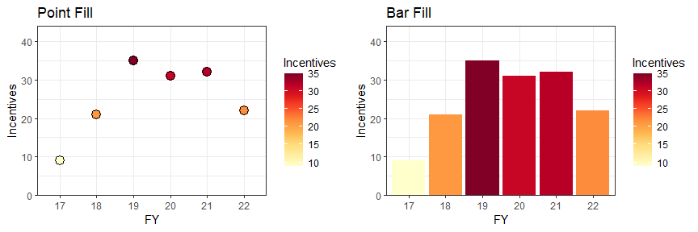

## Non-Data Components

Two functions were created to give the non-data components of the
graphics plots a look that is customized to match the branding
guidelines. The functions make it easier to change the color of the plot
background, panel background, and text, and to include the City logo, a
shaded footer, and to save the graphics plot.

### covdata_theme()

**`covdata_theme()`** has three arguments–**plot.background.fill**,
**panel.background.fill** and **text.color**.

-   **plot.background.fill** is the color to use to fill the background
    of the entire plot
-   **panel.background.fill** is the color to use to fill the background
    of the plotting area
-   **text.color** is the color to use for the title, subtitle,
    captions, and text on plot axes

The *plot.background.fill* argument can only accept color names on the
Pantones and Neutral color palettes. The *panel.background.fill*
argument can only accept Covington.Plain (white), Covington.Light.Gray,
and Covington.Gray. The argument *text.color* can accept any color name.

``` r
#Define covdata_theme function

#` function to fill backgrounds and chagne text color
covdata_theme <<- function(plot.background.fill = c("covington.plain",
                                                    "covington.black", 
                                                    "covington.blue", 
                                                    "covington.navy", 
                                                    "covington.dark.blue",
                                                    "covington.light.blue",
                                                    "covington.green",
                                                    "covington.yellow",
                                                    "covington.gray",
                                                    "covington.light.gray",
                                                    "covington.og.blue"),
                           panel.background.fill = c("covington.plain", 
                                                     "covington.light.gray", 
                                                     "covington.gray",
                                                     "covington.black",
                                                     "covington.blue",
                                                     "covington.light.blue"),
                           text.color = c("covington.black", "covington.plain")){      
  
  
  
  #assign font family up front
  font <- "Franklin Gothic Medium"                
  
  #replace elements we want to change
  theme_bw() %+replace%                          
    
    
    #Custom theme settings
    
    theme(
      
      #All text font
      text = ggplot2::element_text(family = font, color = unname(covington_colors[match.arg(text.color)])),
      
      #Title format
      title = ggplot2::element_text(color = unname(covington_colors[match.arg(text.color)])),
      
      #Axis format
      axis.text = ggplot2::element_text(colour = unname(covington_colors[match.arg(text.color)]),
                               size = 9),
      axis.ticks = ggplot2::element_line(color = unname(covington_colors[match.arg(text.color)])),
      
      axis.title.y = ggplot2::element_blank(),
      axis.title.x = ggplot2::element_text(margin = margin(t=10,b=15), size = 10),
      
      #Facet wrap background color
      strip.background = ggplot2::element_rect(fill="#cccccc"),
      
      #Legend format
      legend.position = "top",
      legend.justification = "left",
      legend.direction = "horizontal",
      legend.text.align = 0,
      legend.margin = ggplot2::margin(l = -0.2, unit = "cm"),
      
      legend.background = ggplot2::element_blank(),
      legend.title = ggplot2::element_blank(), 
      legend.key = ggplot2::element_blank(),
      legend.text = ggplot2::element_text(family=font, size=8),
      
      #color fill for plot and panel backgrounds
      plot.background = ggplot2::element_rect(fill = unname(covington_colors[match.arg(plot.background.fill)]),
                                              colour = NA),
      
      panel.background = ggplot2::element_rect(fill = unname(covington_colors[match.arg(panel.background.fill)])),
      
      #margins for plot and caption
      plot.margin = ggplot2::margin(t = 0.2, r = 0.2, b = 0.2, l = 0.2, unit = "cm"),
      plot.caption = ggplot2::element_text(margin = margin(t=15,b=0, r=-0.7), hjust = 1, size = 9)
      
    )
}
  


cov_graph_theme <- cov_graph +
    
  #specifying labels  
  labs(x = "Fiscal Year", 
       y = "Incentives\n", 
       title = "Total Incentives Authorized",
       subtitle = "Fiscal Years 2017-2022",
       caption = "Economic Development\nCity of Covington\n2022 | CovData")
  

  
cov_graph_theme + 
  geom_bar(stat = "identity") +
  #covdata_fill_d("Set3")+
  #facet_wrap(~Use)+
  
  covdata_theme()
```

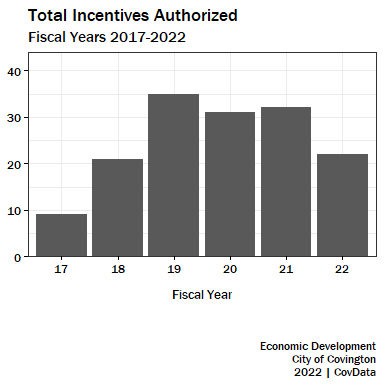

### covdata_plot()

**`covdata_plot()`** was created to make it finalize the graphics plot
for distribution. The function has five arguments–**plot**, **logo**,
**save_name**, **save_width**, and **save_height**.

-   **plot** is the ggplot object containing the data and style
    components.
-   **logo** is the City logo we want to use from the seven options
    listed in the *City logos* section.
-   **save_name** is the name to use to save the graphics plot (e.g.,
    “test.png”).
-   **save_width** is the width in inches for the saved graphics plot.
-   **save_height** is the height in inches for the saved graphics plot.

The example below builds on the previous example and adds a City logo

``` r
covdata_plot <<- function(plot, logo = c("cov.seal.blue", "cov.seal.white", "cov.logo.blue",
                                  "cov.logo.white"), 
                          save_name,
                          save_width = 5,
                          save_height = 4){


logo_name <- unname(covington_logos[match.arg(logo)])  

logo_file <- magick::image_read(logo_name)
logo_sized <- magick::image_resize(logo_file, 200)
  
 
footer <- grid::grobTree(
  grid::linesGrob(
  x = grid::unit(c(0.001, 1.1), "npc"), 
  y = grid::unit(0.61, "in"),
  gp = gpar(col = "#1100ff", lwd = 3)),
  grid::rasterGrob(logo_sized, x = 0.004, vjust = -0.10, just = c('left', 'bottom'), 
                   width = unit(1.4, 'inches')))
 
grob <- ggplot2::ggplotGrob(plot) 

plot_grid <- ggpubr::ggarrange(grob, footer,
                                 ncol = 1, nrow = 2,
                                 heights = c(1, 0.001))

if(!missing(save_name)) {
  
  
  final.plot <- grid.draw(plot_grid)
    
  ggplot2::ggsave(paste(save_name, "_", lubridate::today(), ".png", sep = ""),final.plot, 
              device = "png", width = save_width, height = save_height, unit = "in", dpi = 120)
  
  }

else {


grid.draw(plot_grid)
  
  }

}
```

# Main Styles

This section lays out the primary styles for use when publishing
graphics using City of Covington data.

## Covington.Basic

``` r
#Covington.Basic
cov_basic <- cov_graph_theme +
  geom_bar(stat = "identity") +
  #covdata_fill_d("Set3")+
  #facet_wrap(~Use)+
  
  covdata_theme()

cov_basic <- covdata_plot(cov_basic, "cov.logo.blue")
```

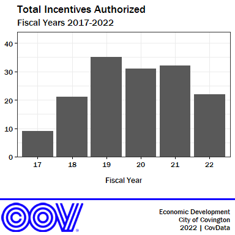

## Covington.Dark

``` r
#Covington.Dark
cov_gray <- cov_graph_theme +
  geom_bar(stat = "identity") +
  #covdata_fill_d("Set3")+
  #facet_wrap(~Use)+
  
  covdata_theme(plot.background.fill = "covington.gray", text.color = "covington.plain")

covdata_plot(cov_gray, "cov.logo.white")
```


## Covington.Gray

``` r
#Covington.Gray
cov_gray <- cov_graph_theme +
  geom_bar(stat = "identity") +
  #covdata_fill_d("Set3")+
  #facet_wrap(~Use)+
  
  covdata_theme(plot.background.fill = "covington.light.gray")

covdata_plot(cov_gray, "cov.seal.blue")
```


## Covington.Quirky

``` r
#Covington.Quirky
cov_quirky <- cov_graph_theme +
  geom_bar(stat = "identity", fill = covdata_color("covington.green")) +
  #covdata_fill_d("Set3")+
  #facet_wrap(~Use)+

 
  covdata_theme(panel.background.fill = "covington.blue",  
                plot.background.fill = "covington.light.blue",
                text.color = "covington.plain")

covdata_plot(cov_quirky, "cov.logo.white")
```


# Extras

## covdata_palettes_print()

**`covdata_palettes_print()`** was created to visualize one palette at a
time from the list of 14 palettes contained in
**covdata_palette_colors**. The graphic below displays the **Pantones**
palette.

``` r
# function to print one color palette and modify by type and number of colors
# calls the covdata_palettes function to create palette
covdata_palettes_print <<- function(name, n, ...){
  
  pal <- covdata_palettes(name, n, ...)
  
  show_col(pal, )
  
}

covdata_palettes_print("Pantones")
```

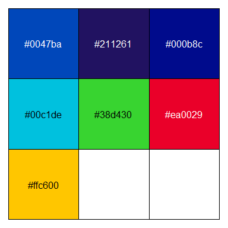

## covdata_palettes_all()

**`covdata_palettes_all()`** was created to visualize **ALL** palettes
simultaneously from the list of 14 palettes contained in
**covdata_palette_colors**.

``` r
# function to print all color paletttes in a list
covdata_palettes_all <<- function(palette_list, palette_names){
  nr <- length(palette_list)
  nc <- max(lengths(palette_list))
  ylim <- c(0, nr)
  oldpar <- par(mgp = c(2, 0.25, 0))
  on.exit(par(oldpar))
  plot(1, 1, xlim = c(0, nc), ylim = ylim, type = "n", axes = FALSE, 
       bty = "n", xlab = "", ylab = "")
  for (i in 1:nr) {
    nj <- length(palette_list[[i]])
    shadi <- palette_list[[i]]
    rect(xleft = 0:(nj - 1), ybottom = i - 1, xright = 1:nj, 
         ytop = i - 0.1, col = shadi, border = "light grey")
  }
  text(rep(-0.1, nr), (1:nr) - 0.6, labels = palette_names, xpd = TRUE, 
       adj = 1)
}

palette_list <<- list(covdata_palette_colors[[14]], 
                     covdata_palette_colors[[13]], 
                     covdata_palette_colors[[12]], 
                     covdata_palette_colors[[11]],
                     covdata_palette_colors[[10]],
                     covdata_palette_colors[[9]],
                     covdata_palette_colors[[8]],
                     covdata_palette_colors[[7]],
                     covdata_palette_colors[[6]],
                     covdata_palette_colors[[5]],
                     covdata_palette_colors[[4]],
                     covdata_palette_colors[[3]],
                     covdata_palette_colors[[2]],
                     covdata_palette_colors[[1]])


palette_names <<- rev(c("Brand", 
                   "Pantones", 
                   "Neutrals", 
                   "Blues", 
                   "Greens", 
                   "Reds", 
                   "Greys", 
                   "YlOrRd", 
                   "YlGnBu",
                   "RdYlBu",
                   "RdBu",
                   "Spectral",
                   "Paired",
                   "Set3"))

covdata_palettes_all(palette_list, palette_names)
```

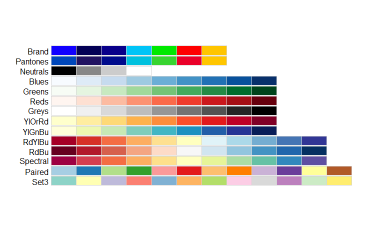
